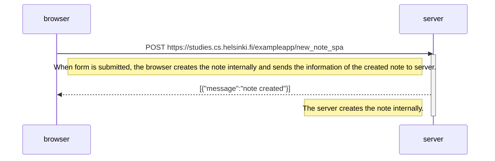

```mermaid
sequenceDiagram
    participant browser
    participant server
    
    browser->>server: POST https://studies.cs.helsinki.fi/exampleapp/new_note_spa
    activate server
    Note right of browser: When form is submitted, the browser creates the note internally and sends the information of the created note to server. 
    server-->>browser: [{"message":"note created"}]
    Note left of server: The server creates the note internally.
    deactivate server
```
